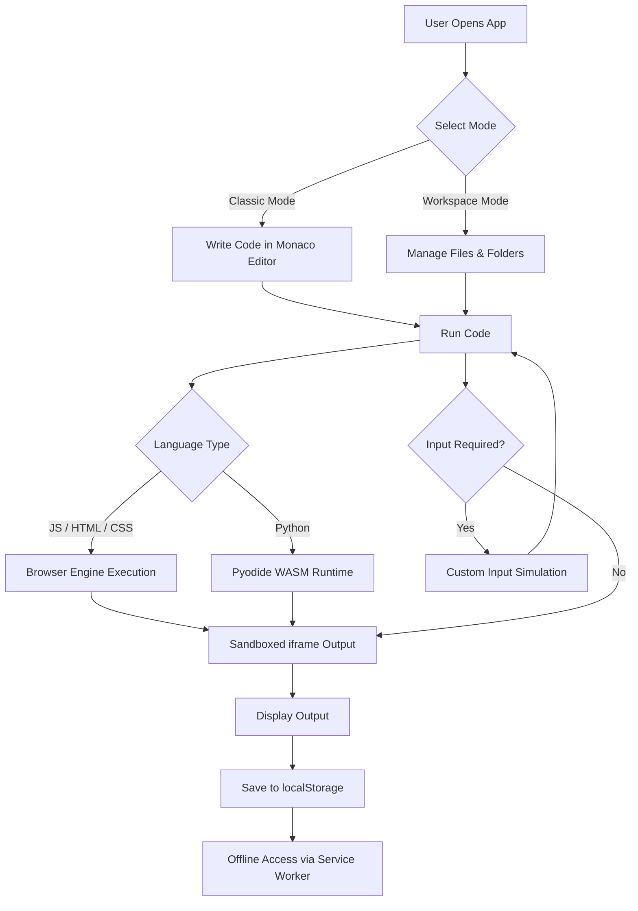

# Offline CodeForge

Offline-first browser-based code playground built with **React, Vite, Monaco Editor, and Chakra UI**.

---

## Features

### 🧾 Classic Mode
- Run **JavaScript and Python** instantly in the browser  
- Supports **terminal-style input simulation**  
- No setup, no installation required  

### Workspace Mode
- Multi-file project support  
- File explorer with:
  - Create, rename, delete files and folders  
  - Drag and drop support  
  - Import files and folders  
- Tab-based editing system  
- Persistent storage using browser storage  

### Python Runtime
- Python runs directly in the browser using **Pyodide (WebAssembly)**  
- No installation or environment setup required  
- Runtime files served locally  

### Offline Support
- Works fully offline after initial load  
- Uses service worker caching  
- No backend or internet dependency  

### PWA Support
- Installable as a Progressive Web App  
- App-like experience on desktop and mobile  

---

## Tech Stack

- React.js – Frontend framework  
- Vite – Build tool  
- Monaco Editor – Code editor  
- Chakra UI – UI components  
- Pyodide (WebAssembly) – Python execution  
- Service Workers – Offline caching  

---

## Run Locally
npm install
npm run dev

## Production
npm run build
npm run preview

---

## 🔄 Execution Workflow

---

## Screenshots

### Landing Page - Both Light and Dark Theme 

---

## MAIN EDITOR 

---

## HTML/CSS PLAYGROUND

## Offline Flow

1. Open the app while connected to the internet  
2. Launch the app once to initialize  
3. Wait for runtime and cache warmup  
4. Reload the application  
5. Turn off internet and continue using offline  

---

## Shortcuts

- Ctrl + Enter → Run code in Classic Mode  
- Ctrl + P → Quick open files in Workspace Mode  

---

## Key Highlights

- Zero setup required  
- Fully offline capable  
- Instant execution with no latency  
- Secure execution inside browser sandbox  

---

## Vision

Making coding **accessible, visual, and offline-first for everyone, everywhere**
